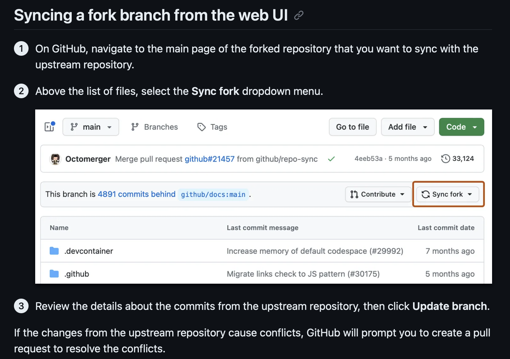

# COMP 2230-02 Git & GitHub Lab Guide

**Instructor:** Shivani Tyagi, Sessional Faculty  
**Department:** Computing Science  
**Institution:** Thompson Rivers University  
**Email:** styagi@tru.ca  
**Course:** COMP 2230-02 Data Structures & Algorithms  
**Lab Session:** Git/GitHub Workflow for Assignments

---

## Table of Contents

1. [Getting Started with GitHub Repo](#1-getting-started-with-github-repo)
2. [Basic Git Commands](#2-basic-git-commands)
3. [Forking & Staying Synced](#3-forking--staying-synced)
4. [Command Line Basics](#4-command-line-basics)
5. [Best Practices for COMP 2230](#5-best-practices-for-comp-2230)

---

## 1. Getting Started with GitHub Repo

### Fork the Repository

1. Go to course repo: `https://github.com/ShivaniTyagiCS2026/COMP-2230-02.git`
2. Click **Fork** (top-right) → creates your copy under your GitHub account
3. **Why fork?** Safe to experiment without affecting the original repository

**Screenshot steps:**
- Navigate to the repository
- Click the "Fork" button
- GitHub creates a copy at `https://github.com/ShivaniTyagiCS2026/COMP-2230-02.git`

### Download (ZIP) - Quick Start

For quick viewing without version control:

1. On your fork page → **Code** dropdown → **Download ZIP**
2. Extract to `~/comp2230-labs/[lab-name]` or your preferred location
3. **Use for:** One-off viewing, testing locally without Git history

**Advantages:**
- Fastest way to get files locally
- No Git setup required
- **Disadvantage:** No version control tracking

### Clone (Recommended for Lab Work)

Clone creates a local Git repository with full version history:

```bash
git clone https://github.com/ShivaniTyagiCS2026/COMP-2230-02.git
cd comp2230-02/
```

**What this does:**
- Creates local copy with full Git history
- Enables tracking of all changes
- Allows easy push/pull with remote repository
- **Best for:** Regular lab submissions and assignment tracking

## SYNC FORK


---

## 2. Basic Git Commands

Essential commands for COMP 2230 lab submissions:

### Status & Staging

| Command | Purpose | Example |
|---------|---------|---------|
| `git status` | Check working directory status | Shows modified, staged, and untracked files |
| `git add .` | Stage all changes for commit | Stage entire project directory |
| `git add file.java` | Stage specific file | Stage only `StackDemo.java` |
| `git diff` | See unstaged changes | Compare working directory to last commit |

### Committing

| Command | Purpose | Example |
|---------|---------|---------|
| `git commit -m "msg"` | Commit staged changes with message | `git commit -m "Implemented push/pop operations"` |
| `git commit --amend` | Modify the last commit | Fix commit message or add forgotten files |
| `git log --oneline` | View commit history (compact) | See all commits in order |
| `git log --graph --oneline --all` | Visual commit history | See branches and merges |

### Viewing Changes

| Command | Purpose |
|---------|---------|
| `git show HEAD` | Show details of last commit |
| `git diff HEAD~1` | Compare current to previous commit |
| `git blame file.java` | See who changed each line |

### Typical Workflow

```bash
# 1. Make changes to files
#    (edit StackDemo.java, ArrayStack.java, etc.)

# 2. Check what changed
git status
git diff

# 3. Stage changes
git add ArrayStack.java StackDemo.java

# 4. Verify staged changes
git status

# 5. Commit with descriptive message
git commit -m "Add: Implement Stack push/pop/peek operations"

# 6. View commit history
git log --oneline
```

---

## 3. Forking & Staying Synced

### Understanding Fork Relationships

When you fork a repository:
- **Origin** = your fork (on your GitHub account)
- **Upstream** = instructor's original repository

### Sync Your Fork with Upstream (Original Repo)

Keep your fork updated with instructor changes:

```bash
# Add upstream reference (one time)
git remote add upstream https://github.com/ShivaniTyagiCS2026/COMP-2230-02.git

# Verify remotes
git remote -v
# Output:
# origin   https://github.com/ShivaniTyagiCS2026/COMP-2230-02.git
# upstream  https://github.com/ShivaniTyagiCS2026/COMP-2230-02.git
```

**Fetch and merge upstream changes:**

```bash
# Fetch latest from instructor's repo
git fetch upstream

# Switch to main branch
git checkout main

# Merge upstream changes
git merge upstream/main

# Push merged changes to your fork
git push origin main
```

**Best Practice:** Run this weekly before starting labs!

### Submit Work via Pull Request

**Step 1: Create a feature branch**
```bash
git checkout -b feature/lab-1-stack-implementation
```

**Step 2: Make your changes and commit**
```bash
git add .
git commit -m "Complete: Lab 1 - Stack implementation with all operations"
```

**Step 3: Push to your fork**
```bash
git push -u origin feature/lab-1-stack-implementation
```

**Step 4: Create Pull Request on GitHub**
1. Navigate to your fork on GitHub
2. Click "Compare & pull request" button
3. Write descriptive title: `Lab 1: Stack Implementation - COMP 2230`
4. Add description:
   - What was implemented
   - Any challenges encountered
   - Time spent on lab
5. Click "Create Pull Request"

**Step 5: Wait for review and feedback**
- Instructor/TA reviews your code
- You may need to make requested changes
- Push additional commits to same branch
- Once approved, your PR is merged

### Handling Multiple Labs

For each new lab, create a new feature branch:

```bash
# Ensure you're on updated main
git checkout main
git pull upstream main

# Create new lab branch
git checkout -b feature/lab-2-linked-list

# ... make changes, commit, push
```

---

## 4. Command Line Basics

Navigate and manage files in terminal/command prompt:

### Navigation & Directory Operations

| Command | Windows Alternative | Example |
|---------|-------------------|---------|
| `pwd` | `cd` (shows current path) | Print working directory |
| `ls` | `dir` | List files in current folder |
| `cd folder` | `cd folder` | Change to "folder" directory |
| `cd ..` | `cd ..` | Go up one level (parent directory) |
| `cd ~` | `cd %USERPROFILE%` | Go to home directory |
| `mkdir lab1` | `mkdir lab1` | Create new directory "lab1" |
| `mkdir -p a/b/c` | `mkdir a\b\c` | Create nested directories |

### File Operations

| Command | Windows Alternative | Example |
|---------|-------------------|---------|
| `touch file.java` | `type nul > file.java` | Create empty file |
| `cat file.java` | `type file.java` | Display file contents |
| `cp file.java file_backup.java` | `copy file.java file_backup.java` | Copy file |
| `mv old.java new.java` | `move old.java new.java` | Rename/move file |
| `rm file.java` | `del file.java` | Delete file |
| `rm -r folder` | `rmdir /s folder` | Delete folder and contents |
| `grep "pattern" file.java` | `findstr "pattern" file.java` | Search in file |

### Useful Terminal Tricks

```bash
# Clear terminal screen
clear          # Mac/Linux
cls            # Windows

# Show file tree structure
tree           # Mac/Linux
tree           # Windows (if installed)

# Check if command exists
which git      # Mac/Linux
where git      # Windows

# Show command help
man git        # Mac/Linux detailed manual
git --help     # Short help (all platforms)
```

### Using VS Code Terminal

**Recommended for COMP 2230:**
- Press `Ctrl + ~` (backtick) to open integrated terminal
- Same commands work as system terminal
- Easy switching between code editor and terminal
- Git status visible in VS Code

---

## 5. Best Practices for COMP 2230

### Commit Message Conventions

Write clear, descriptive commit messages:

**Good Examples:**
```
Add: Implement Stack push() method
Fix: Null pointer in peek() when stack empty
Refactor: Simplify Stack constructor logic
Test: Add unit tests for LinkedList operations
Doc: Update README with usage examples
```

**Bad Examples (Avoid):**
```
updated code
fixed stuff
changes
asdf
work in progress
```

**Format:**
```
[Type]: [Description in present tense]
```

Types: `Add`, `Fix`, `Refactor`, `Test`, `Doc`, `Remove`, `Update`

### Branch Naming Conventions

Use clear, descriptive branch names:

```bash
feature/lab1-stack-implementation
feature/array-vs-linkedlist-comparison
bugfix/stack-overflow-issue
refactor/iterator-pattern
doc/add-javadoc-comments
```

**Pattern:** `[type]/[lab-number]-[feature-name]`

### Commit Early and Often

- Commit after completing logical units
- Not just at lab end
- Easier to track changes
- Can revert individual commits if needed

Example workflow:
```bash
# After implementing push()
git commit -m "Add: Stack push() operation"

# After implementing pop()
git commit -m "Add: Stack pop() operation"

# After testing everything
git commit -m "Test: Verify all Stack operations work correctly"
```

### Use .gitignore

Create `.gitignore` file in repo root to exclude unnecessary files:

```
# Compiled Java files
*.class
*.jar
*.war

# IDE files
.idea/
.vscode/
*.swp
*.swo

# Build artifacts
target/
build/

# OS files
.DS_Store
Thumbs.db

# Backup files
*.bak
*~
```

This prevents committing compiled code and IDE settings.

### Pull Before Push

Always fetch latest changes before pushing:

```bash
# Before pushing your changes
git pull origin main

# Resolve any conflicts (if necessary)

# Then push
git push origin feature/lab-1-stack
```

This prevents "push rejected" errors.

### Pull Request (PR) Template

When submitting PR, include:

```markdown
## Lab Submission: Lab 1 - Stack Implementation

### What was implemented:
- Implemented ArrayStack<T> class with generic type support
- Completed push(), pop(), peek() operations
- Added isEmpty() and isFull() checks

### Key Implementation Details:
- Used dynamic array resizing when capacity exceeded
- Top pointer initialized to -1 for empty stack
- All operations throw appropriate exceptions for edge cases

### Testing:
- Manual testing with integer and string generics
- Tested all operations with full and empty stacks
- Verified memory efficiency with large datasets

### Time Spent:
- Implementation: 2 hours
- Testing and debugging: 1 hour
- Total: 3 hours

### Questions/Issues:
- None - implementation completed as specified
```

### Lab Submission Checklist

Before submitting PR:

- [ ] Code compiles without errors
- [ ] All required methods implemented
- [ ] Code follows Java style conventions
- [ ] Comments explain complex logic
- [ ] Tested with multiple inputs
- [ ] No debugging print statements left
- [ ] No uncommitted changes
- [ ] PR title clearly identifies lab
- [ ] PR description is descriptive
- [ ] Feature branch name is meaningful

### Handling Merge Conflicts

If multiple people edit the same file:

```bash
# After pull fails due to conflict
git status  # See conflicting files

# Open conflicting file - you'll see:
<<<<<<< HEAD
your changes here
=======
their changes here
>>>>>>> incoming-branch

# Edit file to keep desired code
git add resolved_file.java
git commit -m "Fix: Resolve merge conflict in Stack implementation"
```

### Recovering from Mistakes

```bash
# Undo last commit (keep changes)
git reset --soft HEAD~1

# Undo last commit (discard changes)
git reset --hard HEAD~1

# Undo uncommitted changes
git checkout -- file.java

# View previous version
git show HEAD~1:file.java
```

---

## Additional Resources

- **Git Official Docs:** https://git-scm.com/docs
- **GitHub Guides:** https://guides.github.com
- **Interactive Git Learning:** https://learngitbranching.js.org
- **Command Explanations:** https://explainshell.com

---

## Quick Reference Card

### Clone and Setup
```bash
git clone [url]
git config user.name "Name"
git config user.email "email@tru.ca"
```

### Daily Workflow
```bash
git status
git add .
git commit -m "message"
git push origin branch-name
```

### Sync with Instructor
```bash
git fetch upstream
git merge upstream/main
git push origin main
```

### Create and Submit Lab
```bash
git checkout -b feature/lab-1
# Make changes...
git add .
git commit -m "message"
git push -u origin feature/lab-1
# Create PR on GitHub
```

---

**Questions?** Contact Shivani Tyagi at [styagi@tru.ca](mailto:styagi@tru.ca)

**Last Updated:** January 2026